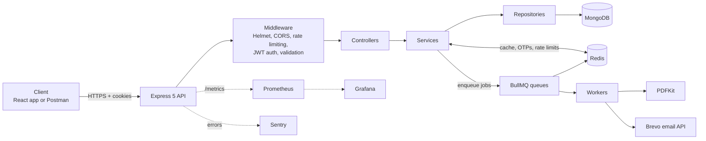
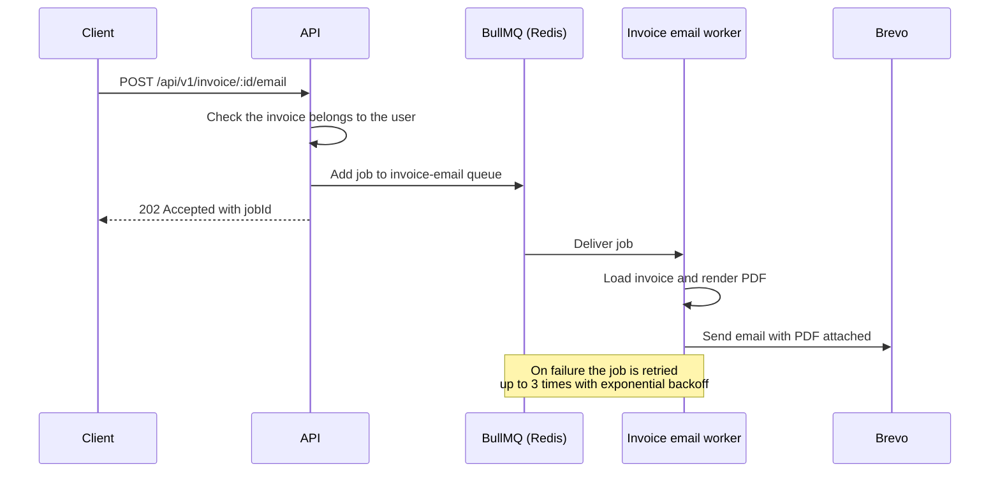

<div align="center">

# 🧾 Invoice Processing & Async Email Automation API

**A production-style REST API for invoicing, with background PDF generation and email delivery powered by BullMQ and Redis.**

<p>
  <a href="https://github.com/nikhilsingh2764/invoice-processing-and-async-email-automation-api/actions/workflows/ci.yml"></a>
  
  
  
  
  
  
</p>

<p>
  <a href="https://invoice-backend-drqr.onrender.com/api/v1/health">Live API</a> ·
  <a href="https://invoice-backend-drqr.onrender.com/api-docs">Swagger Docs</a> ·
  <a href="https://invoicepilot-zeta.vercel.app">Frontend Demo</a> ·
  <a href="https://www.postman.com/technical-physicist-35686083-s-team/workspace/invoice-generator-api/collection/39798617-83cff721-5ce7-4e00-ba58-0d49017d3f39?action=share&creator=39798617">Postman Collection</a>
</p>

</div>

> **Note:** The live API runs on Render's free tier, so the first request after a period of inactivity can take a few seconds while the service wakes up.

---

## 📖 About

This project is the backend of **InvoicePilot**, an invoice management platform. Businesses can manage their profile, customers and products, create multi-item invoices with automatic tax and discount calculation, download invoices as PDFs, and email them to customers.

The main goal was to build it the way a real service is built, not as a simple CRUD demo:

- **Slow work never blocks a request.** PDF generation and email delivery run in background workers (BullMQ on Redis) with automatic retries and exponential backoff, and the API answers immediately with `202 Accepted`.
- **Security is layered.** OTP email verification, bcrypt password hashing, short-lived JWT access tokens with rotating refresh tokens in HTTP-only cookies, account lockout, and Redis-backed rate limiting on every sensitive endpoint.
- **It is observable and deployable.** Health probes, Prometheus metrics with a Grafana dashboard, Sentry error tracking, structured JSON logs, a Docker image, and a CI/CD pipeline that deploys to Render and verifies the release.

---

## ✨ Features

**Invoicing**
- Business profile with a custom invoice prefix and an auto-incrementing invoice number per business
- Customer and product management with search, filtering, and pagination
- Multi-item invoices with automatic per-line discount and tax calculation
- Invoice statuses: `Draft`, `Pending`, `Paid`, `Partially Paid`, `Overdue`, `Cancelled`
- Payment methods: Cash, UPI, Credit Card, Debit Card, Bank Transfer, Cheque
- Invoice duplication that keeps the original payment terms
- Invoices store a **snapshot** of the business and customer details, so old invoices never change when a profile is edited

**Async processing**
- PDF invoices generated in the background with PDFKit and cached in Redis
- Invoice emails (with the PDF attached) sent through the Brevo API from a worker
- OTP, welcome, and password-reset emails sent through the same queue system
- Three retry attempts with exponential backoff for every job

**Authentication & accounts**
- Email signup with 6-digit OTP verification
- Google sign-in
- Login, logout, profile update, change password, forgot and reset password (by OTP)
- Deactivate and delete account

**Analytics dashboard**
- One endpoint returns stats, revenue chart, invoice status chart, top customers, top products, and recent invoices
- Server-side search, payment-status filter, date range, sorting, and pagination, built on MongoDB aggregation pipelines

**Operations**
- Health, liveness and readiness endpoints that check MongoDB and Redis
- Prometheus metrics endpoint plus a Grafana container
- Sentry error tracking and Winston structured logging
- Graceful shutdown of the HTTP server, workers, Redis and MongoDB
- Interactive API docs with Swagger UI (OpenAPI 3.0)

---

## 🏗️ Architecture



The code follows a strict layered structure: **routes → controllers → services → repositories → models**. Controllers handle HTTP only, services hold the business logic, and repositories are the only layer that talks to MongoDB.

### Example: emailing an invoice



### Background queues

| Queue | Purpose | Worker action |
| --- | --- | --- |
| `send-email` | OTP, welcome, and password-reset emails | Sends the email through Brevo |
| `invoice-pdf` | On-demand invoice PDF generation | Builds the PDF and caches it in Redis for 1 hour |
| `invoice-email` | Emailing an invoice to a customer | Builds the PDF and sends it as an attachment |

All queues use 3 attempts with exponential backoff (5 s base delay) and keep the last 100 completed and failed jobs. Each worker processes up to 5 jobs concurrently. Workers start together with the API process, and `npm run worker` runs the email worker on its own.

**PDF download flow:** `GET /invoice/:id/pdf` returns the file straight from Redis when it is cached. On a cache miss it queues a job and returns `202` with a `jobId`; once the worker finishes, the next request is served from cache.

---

## 🛠️ Tech Stack

| Category | Technologies |
| --- | --- |
| **Runtime & framework** | Node.js 20, Express 5 (ES modules) |
| **Database** | MongoDB with Mongoose 9 (transactions, aggregation pipelines) |
| **Cache & queues** | Redis (ioredis), BullMQ |
| **Auth & security** | JWT, bcrypt, Helmet, CORS, express-rate-limit with rate-limit-redis, Google OAuth (google-auth-library) |
| **Validation** | express-validator |
| **Documents & email** | PDFKit, Brevo transactional email API |
| **Observability** | Winston, Morgan, Sentry, Prometheus (prom-client), Grafana |
| **API docs** | swagger-jsdoc, swagger-ui-express |
| **i18n** | i18next with English and Hindi message catalogs |
| **DevOps** | Docker, Docker Compose, GitHub Actions, Render |
| **Tooling** | Git, Postman, Nodemon |

---

## 📁 Project Structure

```text
.
├── .github/workflows/ci.yml        # CI/CD pipeline
├── Backend/
│   ├── Dockerfile
│   ├── docker-compose.yml          # API + Redis + MongoDB + Prometheus + Grafana
│   ├── prometheus/prometheus.yml
│   ├── .env.example
│   └── src/
│       ├── server.js               # Startup, workers, graceful shutdown
│       ├── app.js                  # Middleware and route registration
│       ├── config/                 # db, redis, sentry, swagger, metrics, i18n
│       ├── route/                  # Routes with Swagger annotations
│       ├── controller/             # HTTP layer
│       ├── service/                # Business logic
│       ├── repository/             # Database access
│       ├── model/                  # Mongoose schemas
│       ├── validators/             # express-validator rules
│       ├── middleware/             # auth, rate limiters, errors, metrics, logging
│       ├── queues/                 # BullMQ queue definitions
│       ├── worker/                 # BullMQ workers
│       ├── templates/              # HTML email and invoice templates
│       ├── locales/                # en and hi translations
│       └── utils/                  # logger, ApiError, PDF, token helpers
└── Frontend/                       # React + Vite client
```

---

## 🔌 API Reference

Base path: `/api/v1`. Interactive documentation is available at `/api-docs`.

<details open>
<summary><b>Authentication</b></summary>

| Method | Endpoint | Auth | Description |
| --- | --- | --- | --- |
| POST | `/signup` | No | Start signup and send an OTP by email |
| POST | `/verify-otp` | No | Verify the OTP and create the account |
| POST | `/login` | No | Log in and set access and refresh cookies |
| POST | `/google` | No | Sign in with a Google ID token |
| POST | `/refresh-token` | Cookie | Rotate the refresh token and issue new tokens |
| POST | `/forgot-password` | No | Send a password-reset OTP |
| POST | `/reset-password` | No | Reset the password with the OTP |
| GET | `/profile` | Yes | Get the current user |
| POST | `/logout` | Yes | Log out and revoke the refresh token |
| PATCH | `/update-profile` | Yes | Update profile details |
| PATCH | `/change-password` | Yes | Change password |
| PATCH | `/deactivate-account` | Yes | Deactivate the account |
| DELETE | `/delete-account` | Yes | Delete the account |

</details>

<details>
<summary><b>Business, customers and products</b></summary>

| Method | Endpoint | Description |
| --- | --- | --- |
| POST · GET · PATCH · DELETE | `/business` | Manage the business profile |
| POST · GET | `/customer` | Create a customer, list customers |
| GET · PATCH · DELETE | `/customer/:id` | Read, update or delete a customer |
| POST · GET | `/product` | Create a product, list products |
| GET · PATCH · DELETE | `/product/:id` | Read, update or delete a product |

</details>

<details>
<summary><b>Invoices</b></summary>

| Method | Endpoint | Description |
| --- | --- | --- |
| POST | `/invoice` | Create an invoice (runs in a MongoDB transaction) |
| GET | `/invoice/:id` | Get an invoice (Redis-cached) |
| PATCH | `/invoice/:id` | Update an invoice and recalculate totals |
| DELETE | `/invoice/:id` | Delete an invoice |
| GET | `/invoice/:id/pdf` | Download the PDF, or queue generation and get `202` |
| POST | `/invoice/:id/email` | Queue an email with the PDF attached, returns `202` |
| POST | `/invoice/:id/duplicate` | Duplicate an invoice as a new draft |

</details>

<details>
<summary><b>Dashboard and operations</b></summary>

| Method | Endpoint | Description |
| --- | --- | --- |
| GET | `/dashboard` | Stats, charts, and a filterable invoice list |
| GET | `/health` | Full health check (API, MongoDB, Redis) |
| GET | `/health/live` | Liveness probe |
| GET | `/health/ready` | Readiness probe (returns `503` when a dependency is down) |
| GET | `/metrics` | Prometheus metrics |

Dashboard query parameters: `page`, `limit`, `search`, `paymentStatus`, `customerId`, `startDate`, `endDate`, `sortBy`, `sortOrder`.

</details>

---

## 🔐 Security

| Area | Implementation |
| --- | --- |
| **Password storage** | bcrypt hashing with salt |
| **Email verification** | 6-digit OTP stored in Redis with a 5-minute expiry; the account is created only after verification |
| **Sessions** | 15-minute access token and 15-day refresh token, both in `HttpOnly`, `Secure` cookies |
| **Refresh tokens** | Stored server-side and rotated on every use, so a used or revoked token stops working |
| **Brute-force protection** | Account locks for 15 minutes after 5 failed logins, plus per-route rate limiting |
| **Rate limiting** | Redis-backed limiters for login, signup, OTP, password reset, token refresh, and each business, customer, product and invoice action, so limits hold across multiple server instances |
| **Data isolation** | Every repository query is scoped by the authenticated user's ID |
| **HTTP hardening** | Helmet headers, CORS restricted to `CLIENT_URL` with credentials, `trust proxy` for deployment behind a load balancer |
| **Input validation** | express-validator rules on every write endpoint |
| **Errors** | One central error handler returns clean JSON to clients while stack traces go to logs and Sentry |

---

## ⚡ Caching Strategy

| Data | Redis key | TTL | Invalidation |
| --- | --- | --- | --- |
| Business profile | `business:{userId}` | 10 min | Refreshed on update |
| Invoice | `invoice:{invoiceId}:{userId}` | 10 min | Deleted on update or delete |
| Invoice PDF | `invoice:pdf:{userId}:{invoiceId}` | 1 hour | Deleted on update or delete |
| Dashboard | `dashboard:{userId}:{query}` | 10 min | Expires by TTL |
| Signup and reset OTP | `otp:{type}:{email}` | 5 min | Deleted after verification |

---

## 📊 Observability

- **Health:** `/api/v1/health`, `/health/live` and `/health/ready` for Docker, Kubernetes, and uptime monitors
- **Metrics:** `/api/v1/metrics` exposes default Node.js metrics, `http_requests_total`, and the `http_request_duration_seconds` histogram, labelled by method, route and status code
- **Dashboards:** Prometheus and Grafana run alongside the API in Docker Compose
- **Errors:** unhandled errors are captured in Sentry
- **Logs:** Winston writes structured JSON to the console and to `logs/app.log` and `logs/error.log`

---

## 🚀 Getting Started

### Prerequisites

- Node.js 20 or later
- MongoDB (Atlas or a local **replica set**, see the note below)
- Redis 7 or later
- A [Brevo](https://www.brevo.com/) account and API key for email
- A Google OAuth client ID if you want Google sign-in

> **MongoDB note:** invoice creation uses multi-document transactions to allocate invoice numbers safely. Transactions need a replica set, so use MongoDB Atlas or run a local single-node replica set. A plain standalone `mongod` will reject invoice creation.

### Run locally

```bash
git clone https://github.com/nikhilsingh2764/invoice-processing-and-async-email-automation-api.git
cd invoice-processing-and-async-email-automation-api/Backend

cp .env.example .env      # then fill in your values
npm install
npm run dev               # API and workers on http://localhost:8000
```

### Run with Docker

```bash
cd Backend
cp .env.example .env      # required, the compose file reads it
docker compose up --build
```

| Service | URL |
| --- | --- |
| API | http://localhost:8000 |
| Swagger docs | http://localhost:8000/api-docs |
| Prometheus | http://localhost:9090 |
| Grafana | http://localhost:3000 |

The compose file overrides `REDIS_URL` and `MONGODB_URI` to point at its own containers. On macOS or Windows, change the Prometheus target in `prometheus/prometheus.yml` from `172.17.0.1:8000` to `host.docker.internal:8000`.

### Scripts

| Command | What it does |
| --- | --- |
| `npm run dev` | Start the API and workers with Nodemon |
| `npm start` | Start the API and workers (production) |
| `npm run worker` | Run the email worker as a standalone process |

### Environment variables

| Variable | Description |
| --- | --- |
| `PORT` | Server port (default `8000` in Docker) |
| `NODE_ENV` | `development` or `production` |
| `MONGODB_URI` | MongoDB connection string |
| `REDIS_URL` | Redis connection string |
| `CLIENT_URL` | Frontend origin allowed by CORS |
| `ACCESS_TOKEN_SECRET` | Secret for signing access tokens |
| `ACCESS_TOKEN_EXPIRES_IN` | Access token lifetime, for example `15m` |
| `REFRESH_TOKEN_SECRET` | Secret for signing refresh tokens |
| `REFRESH_TOKEN_EXPIRES_IN` | Refresh token lifetime, for example `15d` |
| `BREVO_API_KEY` | Brevo API key for sending email |
| `EMAIL_USER` | Verified sender address in Brevo |
| `GOOGLE_CLIENT_ID` | Google OAuth client ID |
| `SENTRY_DSN` | Sentry project DSN (optional) |

Use long, random values for the token secrets and never commit your `.env` file.

---

## 🔄 CI/CD

Every push and pull request to `main` runs the pipeline in [`.github/workflows/ci.yml`](.github/workflows/ci.yml):

```text
Checkout → Set up Node 20 → npm ci → Build Docker image → Validate docker compose config
                                                 │
                                   (push to main only)
                                                 ▼
                       Trigger Render deploy hook → Wait → Health check on the live API
```

The pipeline fails if the image does not build or if the deployed API does not answer its health endpoint.

---

## 🧠 Design Decisions

- **Queue instead of inline work:** PDF rendering and third-party email calls are slow and can fail. Moving them to BullMQ keeps API latency low and gives retries and backoff for free.
- **Transaction for invoice numbers:** reserving the next invoice number and saving the invoice happen in one MongoDB transaction, so two simultaneous requests can never produce a duplicate number.
- **Snapshots in invoices:** an invoice copies the business and customer details at creation time. Later edits to a profile do not rewrite history, which matters for accounting records.
- **Repository layer:** database access lives in one place, which keeps services testable and makes the user-scoping rule easy to enforce.
- **Redis for shared state:** rate limits, OTPs, and cached data live in Redis, so the API can run as several instances without losing consistency.
- **Graceful shutdown:** on shutdown the server stops taking requests, lets workers finish, then closes Redis and MongoDB.

---

## 🗺️ Roadmap

- [ ] Automated tests (Jest and Supertest) wired into the CI pipeline
- [ ] Routes for polling PDF and email job status (the controllers already exist)
- [ ] Bull Board dashboard for monitoring queues and failed jobs
- [ ] Single-node MongoDB replica set in Docker Compose for one-command local setup
- [ ] Payment-link integration and recurring invoices

---

## 👨‍💻 Author

**Nikhil Singh**, Backend Engineer

[](https://www.linkedin.com/in/nikhil-singh-802594231/)
[](mailto:nikhilsingh2764@gmail.com)
[](https://github.com/nikhilsingh2764)

If you found this project useful, consider giving it a ⭐
